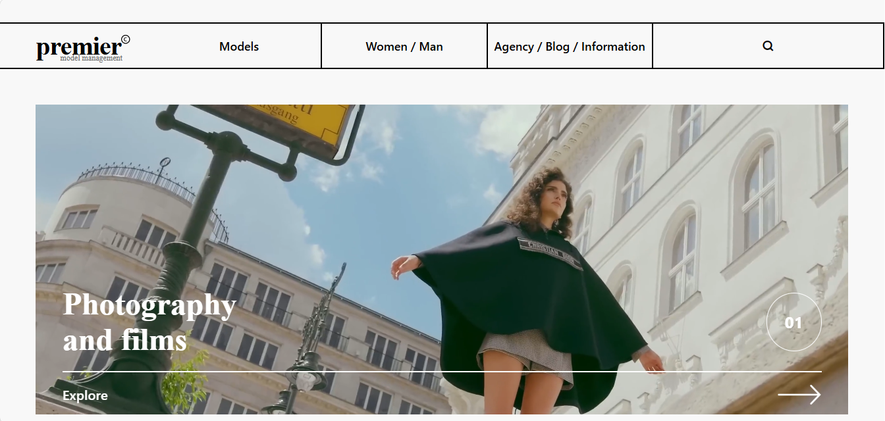
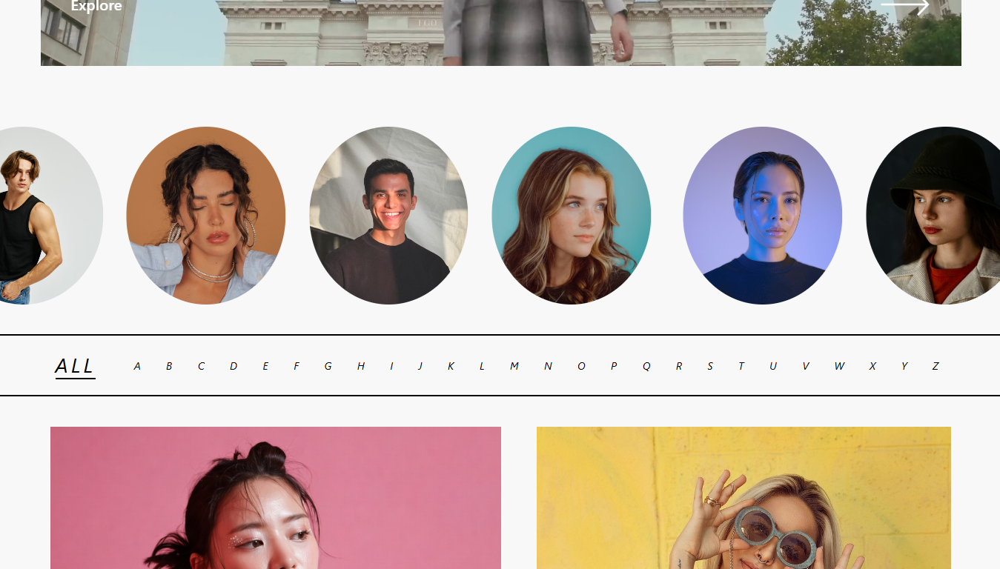
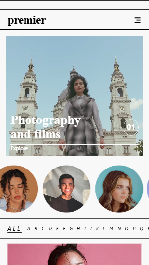

# Premier Model Website

This is a modern fashion/model agency inspired website built using HTML and CSS.
The project focuses on responsive design, smooth animations, interactive UI sections, and clean visual aesthetics.

## Features

* Fully responsive layout
* Video hero section
* Infinite scrolling model slider
* Interactive hover effects
* Animated marquee section
* Mobile-friendly navigation
* Modern typography and clean UI

## Technologies Used

* HTML5
* CSS3
* Remix Icons
* Git & GitHub

## Folder Structure

```bash
premier-model-website/
├── index.html
├── style.css
├── video.mp4
├── README.md
│
├── Images/
│   ├── Image.png
│   ├── culture.png
│   ├── model.png
│   ├── potrait.png
│   ├── text.png
│   ├── desktop-preview.png
│   ├── models-section.png
│   └── mobile-preview.png
```

## Screenshots

### Desktop View



### Models Section



### Mobile Responsive View



## Demo Video

[Watch Demo Video](https://drive.google.com/file/d/1WI6YUu6r_sOR8DF3iS4Kah4bennWFfLt/view?usp=drive_link)

## How to Run

1. Clone the repository:

```bash
git clone https://github.com/kenil948/premier-model-website.git
```

2. Open `index.html` in your browser.

## Live Demo

Check it out here:
https://kenil948.github.io/premier-model-website/

## What I Learned

* Responsive Web Design
* CSS Animations
* Media Queries
* Layout Structuring using Flexbox
* Building modern UI sections
* Improving mobile responsiveness
* Better project structuring with GitHub

## Notes

This is a frontend practice project created for learning and improving UI/UX development skills.
